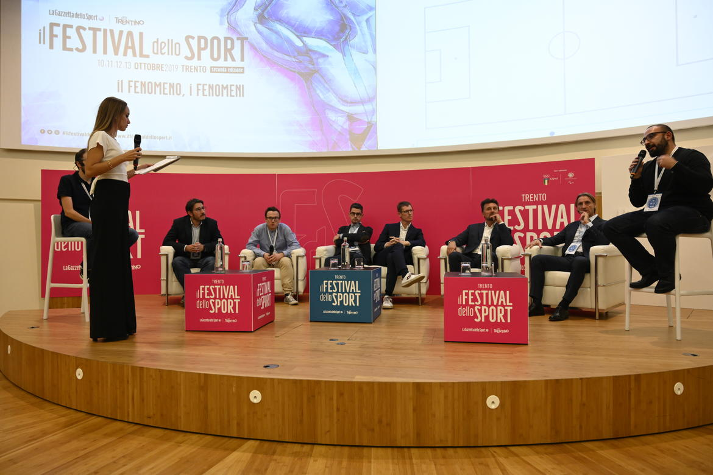
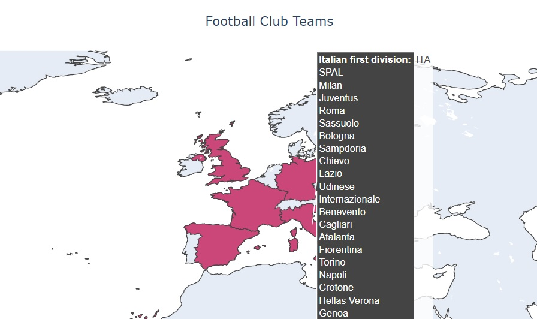

# Soccer-Data-Challenge

Hello there! 😀

The University of Pisa, in collaboration with the CNR, the University of Trento, and Gazzetta dello Sport, organized the 
second edition of the **Soccer Data Challenge**, held as part of the [Festival dello Sport](https://www.ilfestivaldellosport.it/) in Trento.

The Soccer Data Challenge, promoted by [SoBigData](http://sobigdata.eu/index), was a competition open to all data and football enthusiasts. 
The event took place on October 10th and 11th, 2019, in Trento, where participating teams had 30 hours to solve an 
analytical problem related to football, using the largest game event dataset ever released.

Finalists presented their work to a panel of professionals from the worlds of football and Big Data. 
The winning team was awarded a €5,000 prize.

Our team, **Complessati Bomber**, won the title! 🥳😊 

Here the final [presentation](./assets/presentation.pdf)! 💃

<figure>
  
  <figcaption>Creator: FOTO NICOLA ECCHER; Copyright: info@fotonicolaeccher.it</figcaption>
</figure>

## Premise

This project includes only the basic settings and data analysis used during the intense 30-hour competition. Please 
bear with us if most of the work is stored in notebooks—we were racing against the clock, and fatigue was definitely 
kicking in! 😊

## Goal

The objective of the competition was to identify football teams' playing styles. This was achieved by leveraging a 
large dataset of match events from the top 5 European leagues and 2 international competitions.



## Installation

**Python 3.10 is required**

**Example**

```bash
# Create a virtual environment
python -m venv venv

# Activate the virtual environment
# On Windows
venv\Scripts\activate
# On macOS/Linux
source venv/bin/activate
```

Run the following command:

> pip install -r requirements.txt

## License

MIT

## Contact Us

Please open an issue or contact pietro.foini1@gmail.com with any questions.
